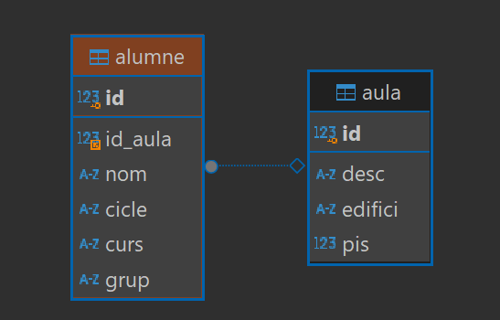
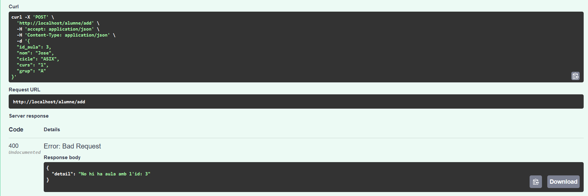
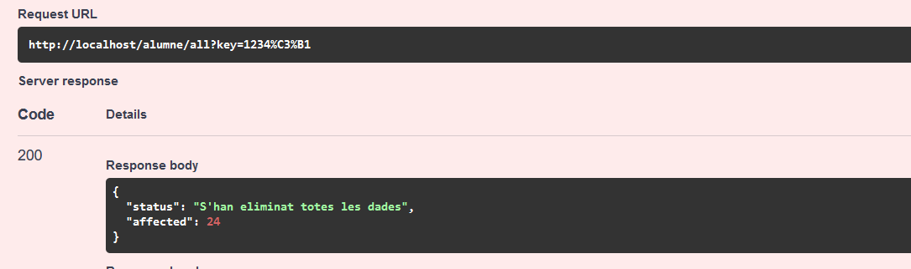

# Documentación de la API

## Introducción

Esta es una API para gestionar alumnos y aulas. La API permite realizar operaciones CRUD (Crear, Leer, Actualizar, Eliminar) sobre los alumnos.

## Instalación

Para instalar y ejecutar la aplicación, sigue estos pasos:

1. Clona el repositorio.
2. Instala las dependencias utilizando `pip install -r requirements.txt`.
3. Ejecuta la aplicación con `python -m uvicorn app.main:app --reload`.

## Uso

Para utilizar la API, puedes hacer peticiones HTTP a los endpoints definidos. A continuación se describen los endpoints disponibles.

## Endpoints de la API

### Alumnos

- **GET /alumne/list**: Obtiene una lista de todos los alumnos.
  - **Respuesta**: Lista de alumnos en formato JSON.

- **GET /alumne/show/{id}**: Obtiene la información de un alumno específico por ID.
  - **Parámetros**: 
    - `id` (int): ID del alumno.
  - **Respuesta**: Información del alumno en formato JSON.

- **POST /alumne/add**: Crea un nuevo alumno.
  - **Body**: 
    ```json
    {
      "nom": "str",
      "cicle": "str",
      "curs": "str",
      "grup": "1 char",
      "id_aula": "int"
    }
    ```
  - **Respuesta**: 
    ```json
    {
      "status": "S'ha afegit correctament",
      "id": "ID del nuevo alumno en la bbdd (int)"
    }
    ```

- **POST /alumne/loadAlumnes**: Crea varios alumnos junto con sus clases
  - **File Attachment**: Fichero en formato CSV con cabecera.
    El formato de los datos del CSV debe ser: `DescAula,Edifici,Pis,NomAlumne,Cicle,Curs,Grup`.
    La cabecera del fichero será ignorada.
  
  - **Respuesta**: Un array con información sobre el estado de cada entrada del CSV junto con los IDs o el el error si sucede alguno.
    ```json
    [
      {
        "status": "Aula ja existeix, s'ha afegit alumne correctament",
        "id_alumne": "id del alumne",
        "id_aula": "id del aula"
      },
      {
        "status": "Estat del error",
        "error": "Missatge de error"
      },
      ...
    ]
    ```

- **PUT /alumne/{id}**: Actualiza la información de un alumno específico por ID.
  - **Parámetros**: 
    - `id` (int): ID del alumno.
  - **Body**: 
    ```json
    {
      "nom": "str",
      "cicle": "str",
      "curs": "str",
      "grup": "1 char",
      "id_aula": "int"
    }
    ```
  - **Respuesta**: 
    ```json
    {
      "status": "S'ha modificat correctament",
      "new_value": {
        "nom": "Nombre Actualizado",
        "cicle": "Ciclo Actualizado",
        "curs": "Curso Actualizado",
        "grup": "Grupo Actualizado",
        "id_aula": "id de Aula actualizada"
      }
    }
    ```

- **DELETE /alumne/all**: Elimina todos los datos y reinicia el AUTOINCREMENT de las tablas.
  - **Parametros**:
    - `key` (str): contraseña de seguridad para confirmar la eliminacion de los datos.
  - **Respuesta**:
    ```json
    {
      "status": "S'han eliminat totes les dades",
      "affected": "Cantidad de datos eliminados (int)"
    }
    ```

- **DELETE /alumne/{id}**: Elimina un alumno específico por ID.
  - **Parámetros**: 
    - `id` (int): ID del alumno.
  - **Respuesta**: 
    ```json
    {
      "status": "S'ha esborrat correctament",
      "dades": {
        "id": 1,
        "id_aula": 1,
        "nom": "Nombre del Alumno",
        "cicle": "Ciclo",
        "curs": "Curso",
        "grup": "Grupo",
        "created_at": "Fecha de creacion",
        "updated_at": "Fecha de ultima modificacion"
      }
    }
    ```

- **GET /alumne/listAll**: Obtiene una lista detallada de todos los alumnos con información adicional.
  - **Respuesta**: Lista de alumnos con información adicional en formato JSON.
    ```json
    [
      {
        "id": "int: id de alumno",
        "nom": "Nombre del Alumno",
        "cicle": "Ciclo",
        "curs": "Curso",
        "grup": "Grupo",
        "desc_aula": "Descripción del Aula",
        "edifici": "Edificio",
        "pis": "Piso"
      },
      ...
    ]
    ```


### Aulas

**Por el momento no hay soporte para los endpoints de aulas pero futuramente habrá**. <br>

## Esquemas de la base de datos




## Demostraciones

A continuación se muestran demostraciones ejecutadas con el programa de testeo propio de FastAPI. Siguiendo la idea de CRUD.

### Creacion de alumnos (CREATE)
- Creacion correcta

- Creacion cuando una aula no existe

- Creacion cuando falta un gampo (grupo)

- Creacion de multiples alumnos


### Obtencion de alumnos (READ)
- Listado de alumnos normal

- Listado completo

- Mostrando por ID

- Mostrando inexistente


### Actualización de alumnos (UPDATE)
- Actualizacion correcta

- Actualizacion con alumno inexistente

- Actualizacion con aula inexistente


### Eliminación de alumnos (DELETE)
- Eliminación correcta

- Eliminación de alumno inexistente

- Eliminación de todos los datos (alumnos + aulas)



